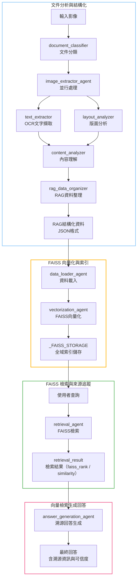
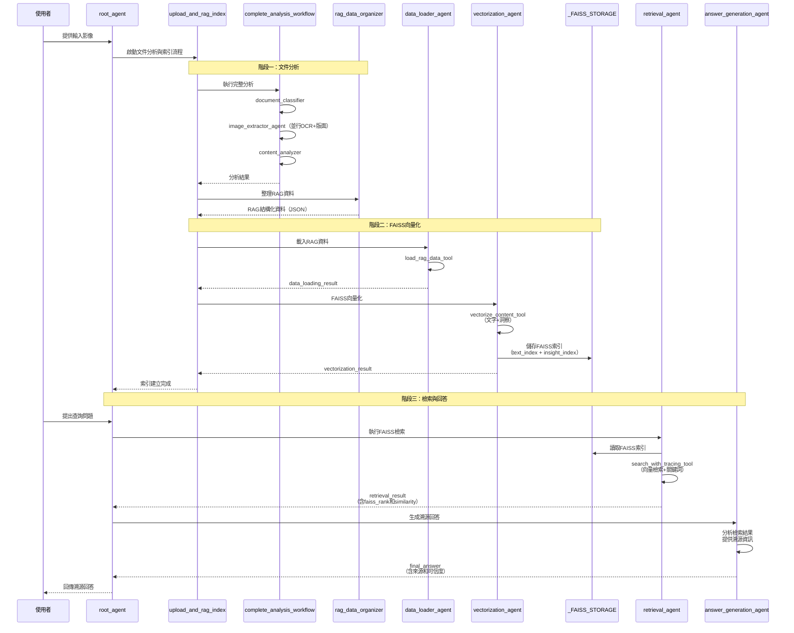
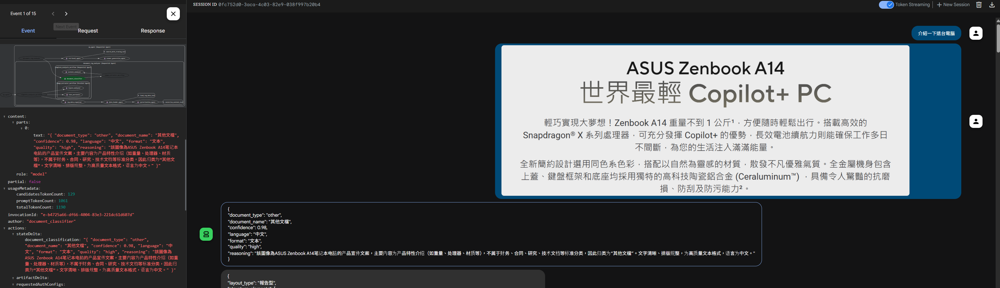
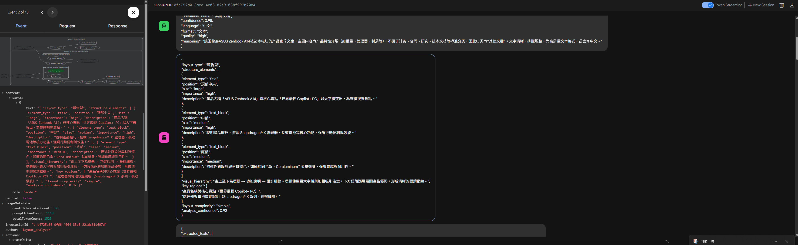
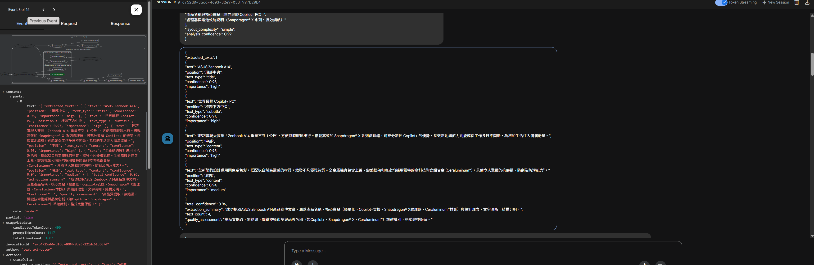
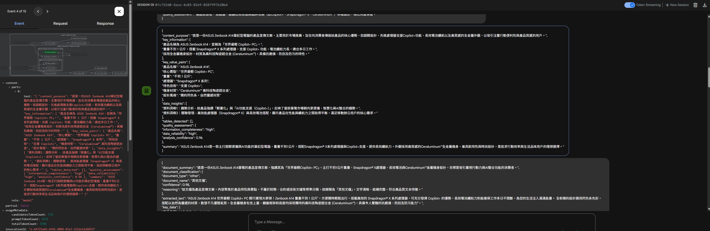
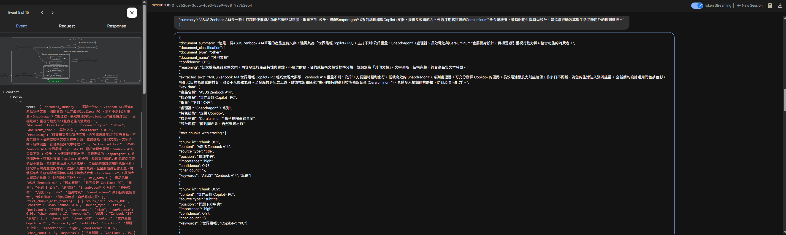
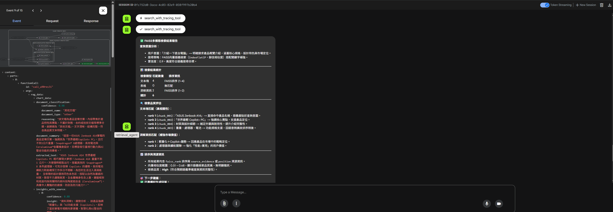
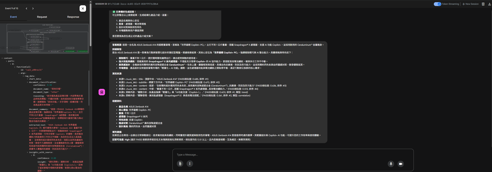
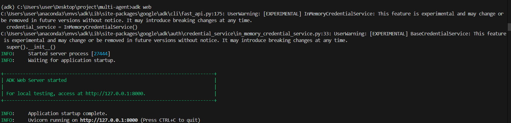

# 多模態 Multi-Agent RAG Sytem 

> 本系統採用基於Agent架構的多階段RAG流程，結合FAISS向量檢索與溯源機制，實現**文件分析 → 向量化索引 → 精確檢索 → 溯源回答**的完整RAG工作流程。

## 系統核心重點

- 透過 SequentialAgent 組織RAG流程，將文件處理分為**資料載入、向量化、檢索、回答生成**四個階段。
- 使用 FAISS IndexFlatIP 進行高效向量檢索，支援餘弦相似度計算。
- 採用全域儲存機制避免ADK序列化問題，確保FAISS索引穩定性。
- 每個回答都包含精確溯源資訊（chunk_id、位置、FAISS排序、相似度分數）。

## 代理人（Agent）功能一覽表

| Agent name                     | 主要功能說明                                                                 | Output Key                |
|-------------------------------|------------------------------------------------------------------------------|-----------------------------|
| document_classifier           | 分析輸入影像，判斷文件類型（財務報表、發票、課程資料等），輸出類型、信心度、語言、格式、品質等資訊。 | `document_classification`   |
| text_extractor                | 執行OCR文字擷取，提取影像中所有可見文字，標註位置、類型、信心度、重要性。           | `text_extraction`           |
| layout_analyzer               | 分析文件版面結構，偵測表格、圖表、文字區塊等元素，描述資訊層次與重點區域。   | `layout_analysis`           |
| **image_extractor_agent**     | 並行執行 `text_extractor` 與 `layout_analyzer`，同時取得OCR與版面分析結果。 | -                           |
| content_analyzer              | 根據分類、OCR、版面分析結果，進行深度內容理解，擷取關鍵資訊、結構化資料、資料洞察與摘要。 | `content_analysis`          |
| **complete_analysis_workflow**| 依序執行 `document_classifier` → `image_extractor_agent` → `content_analyzer`，完成文件分析。 | -                           |
| rag_data_organizer            | 整合`document_classifier`、`text_extraction`、`layout_analysis`、`content_analysis`的分析結果，產生支援溯源的多模態RAG資料結構（JSON格式），分類處理文字、表格、圖表。 | RAG結構化資料               |-                           |
| data_loader_agent             | 從使用者訊息中擷取JSON資料字串，使用 `load_rag_data_tool` 解析並載入RAG資料。 | `data_loading_result`       |
| vectorization_agent           | 從 session.state 取得已載入的RAG資料，使用 `vectorize_content_tool` 建立FAISS向量索引。 | `vectorization_result`      |
| **upload_and_rag_index**      | 整合 `complete_analysis_workflow`, `rag_data_organizer`, `data_loader_agent`, `vectorization_agent`，建立索引工作流程。 | -                           |
| retrieval_agent               | 使用 `search_with_tracing_tool` 執行FAISS向量檢索，支援文字、表格、洞察的多模態檢索。 | `retrieval_result`          |
| answer_generation_agent       | 基於FAISS檢索結果生成帶有精確來源資訊的溯源回答，包含相似度分數和排序資訊。 | `final_answer`              |
| **root_agent**                | 完整RAG工作流程：文件分析 → RAG索引 → 檢索 → 回答生成。                      | -                           |

---

## 整體流程（Flow）與資料傳遞

### 階段一：文件分析與 Chunks 結構化生成

1. **輸入影像**
2. `document_classifier` → 輸出 `document_classification`
3. `image_extractor_agent`（並行）：
    - `text_extractor` → 輸出 `text_extraction`
    - `layout_analyzer` → 輸出 `layout_analysis`
4. `content_analyzer` → 輸出 `content_analysis`
5. `rag_data_organizer` → 輸出 **RAG結構化資料（JSON格式）**

### 階段二：FAISS 向量化與索引構建

6. `data_loader_agent` 使用 `load_rag_data_tool` 載入RAG資料 → 輸出 `data_loading_result`
7. `vectorization_agent` 使用 `vectorize_content_tool` 建立FAISS索引：
    - 文字塊向量化 → 建立 `text_index`（IndexFlatIP）
    - 洞察向量化 → 建立 `insight_index`（IndexFlatIP）
    - 索引儲存至全域空間 `_FAISS_STORAGE`
    - 輸出 `vectorization_result`

### 階段三：FAISS 向量檢索 Retrieval 

8. `retrieval_agent` 使用 `search_with_tracing_tool` 執行檢索：
    - 查詢向量化與歸一化
    - FAISS文字塊檢索（top-k，餘弦相似度）
    - 關鍵詞表格檢索
    - FAISS洞察檢索（top-k）
    - 輸出 `retrieval_result`（包含 faiss_rank 和 similarity）

### 階段四：基於向量檢索生成回答

9. `answer_generation_agent` 基於檢索結果生成回答：
    - 分析FAISS排序與相似度
    - 提供精確溯源資訊（chunk_id、位置、FAISS排序）
    - 評估回答可信度
    - 輸出 `final_answer`

---

## 原理圖（Schematics）



---

## 工作流程順序圖（Sequence Diagram）



---

## 工具函式說明

### RAG資料處理工具

| 工具函式名稱              | 功能說明                                                                 |
|--------------------------|--------------------------------------------------------------------------|
| `load_rag_data_tool`     | 解析JSON字串格式的RAG資料，統計文字塊、表格、圖表、洞察數量，驗證資料完整性。 |
| `vectorize_content_tool` | 使用 bge-m3 模型生成向量，建立FAISS IndexFlatIP索引，向量L2歸一化，儲存至全域空間。 |
| `search_with_tracing_tool` | 執行FAISS向量檢索（文字+洞察）和關鍵詞檢索（表格），返回帶有faiss_rank和similarity的結果。 |
| `get_bailian_embedding`  | 調用 Ollama Embeddings API（bge-m3模型），支援批次處理（每批最多25個文字），返回numpy向量陣列。 |
| `load_local_image`       | 載入本地圖片檔案，返回位元組資料和MIME類型。                                |

---

## 執行過程

下方依照多智能體流程，搭配圖片與說明，展示每個階段的主要任務與產出：

### Step 1: 文件分類（document_classifier）

- 分析輸入影像，判斷文件類型、語言、品質等。


---

### Step 2: 版面結構分析與OCR（layout_analyzer & text_extractor）

- **layout_analyzer**：偵測表格、圖表、區塊，產生版面結構資訊。


- **text_extractor**：執行OCR，擷取所有可見文字，標註位置與信心度。


---

### Step 3: 內容理解（content_analyzer）

- 綜合分類、OCR、版面資訊，萃取關鍵資料、洞察與摘要。


---

### Step 4: RAG資料結構化（rag_data_organizer）

- 整合所有分析結果，產生支援溯源的多模態RAG結構化資料（JSON）。


---

### Step 5: RAG資料載入與向量化（data_loader_agent & vectorization_agent）

- **data_loader_agent**：載入RAG結構化資料，驗證內容。


- **vectorization_agent**：將文字與洞察內容向量化，建立FAISS索引。


---

### Step 6: 檢索與回答生成（retrieval_agent & answer_generation_agent）

- **retrieval_agent**：根據查詢執行FAISS多模態檢索，取得相關內容。


- **answer_generation_agent**：根據檢索結果，生成帶有溯源資訊的最終回答。


---

## 支援的圖片文件類型

```python
SUPPORTED_DOCUMENT_TYPES = {
    "financial_report": "財務報表",
    "invoice": "發票票據", 
    "contract": "合約文件",
    "research_paper": "研究報告",
    "business_chart": "商業圖表",
    "receipt": "收據憑證",
    "form": "表單文件",
    "presentation": "演示文件",
    "course_material": "課程資料",
    "technical_doc": "技術文件",
    "other": "其他文件"
}
```

---

## 環境設定

```python
QWEN_MODEL = "openai/qwen3-vl:235b-cloud"
QWEN_BASE_URL = 'http://localhost:11434/v1'
QWEN_API_KEY = 'your_api_key_here'
```

需要安裝的相依套件：
- `faiss-cpu` 或 `faiss-gpu`（FAISS向量檢索）
- `langchain-ollama`（Ollama Embeddings）
- `google.adk`（ADK框架）
- `numpy`（向量運算）

快速啟動:
在multi-agent底下，輸入 :
```bash
adk web
```
即可在本地啟動ADK Web介面。



---

## 總結

本系統實現了一個完整的溯源多模態RAG流程，透過 Multi-Agent 協作和FAISS向量檢索，實現了從文件分析到精確溯源回答的全自動化處理。系統的核心優勢在於：

1. **完整的文件理解**：分類、OCR、版面分析、內容理解四階段處理
2. **高效的向量檢索**：FAISS IndexFlatIP + 餘弦相似度
3. **精確的溯源機制**：每個回答都包含來源、位置、排序、相似度
4. **穩定的儲存方案**：全域儲存避免序列化問題
5. **多模態支援**：文字、表格、圖表、洞察的統一檢索

